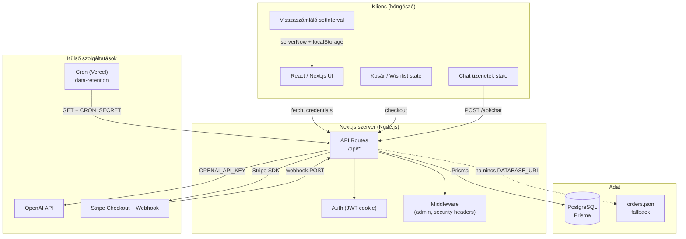

# Architektúra diagram – Gulumen webshop

## Magyarázat

- **Kliens:** React state (kosár, chat, visszaszámláló), minden backend hívás `fetch` + cookie.
- **Next.js szerver:** API routes, session (JWT cookie), middleware (admin, CSP, stb.).
- **Külső:** OpenAI (chat), Stripe (fizetés + webhook), Vercel Cron (napi data-retention).
- **Adat:** PostgreSQL Prisma-val; ha nincs `DATABASE_URL`, rendelésekhez JSON fallback.
